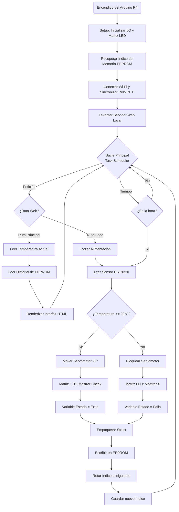

### Diagrama de Flujo del Sistema

```mermaid
graph TD
    %% Inicialización
    A(Encendido del Arduino R4) --> B[Setup: Inicializar I/O y Matriz LED]
    B --> C[Recuperar Índice de Memoria EEPROM]
    C --> D[Conectar Wi-Fi y Sincronizar Reloj NTP]
    D --> E[Levantar Servidor Web Local]
    
    %% Bucle Principal
    E --> F{Bucle Principal<br>Task Scheduler}
    
    %% Rama 1: Servidor Web
    F -->|Petición| G{¿Ruta Web?}
    G -->|Ruta Principal| H[Leer Temperatura Actual]
    H --> I[Leer Historial de EEPROM]
    I --> J[Renderizar Interfaz HTML]
    J --> F
    G -->|Ruta Feed| K[Forzar Alimentación]
    K --> L
    
    %% Rama 2: Control Autónomo
    F -->|Tiempo| M{¿Es la hora?}
    M -->|No| F
    M -->|Sí| L[Leer Sensor DS18B20]
    
    %% Lógica de Seguridad Térmica
    L --> N{¿Temperatura >= 20°C?}
    
    N -->|Sí| O[Mover Servomotor 90°]
    O --> P[Matriz LED: Mostrar Check]
    P --> Q[Variable Estado = Éxito]
    
    N -->|No| R[Bloquear Servomotor]
    R --> S[Matriz LED: Mostrar X]
    S --> T[Variable Estado = Falla]
    
    %% Data Logger y Buffer Circular
    Q --> U[Empaquetar Struct]
    T --> U
    U --> V[Escribir en EEPROM]
    V --> W[Rotar Índice al siguiente]
    W --> X[Guardar nuevo Índice]
    X --> F
```